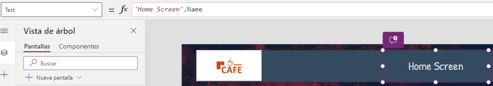

# Asignar nombre de pantalla a un label 

En **PowerApps**, podemos utilizar expresiones como: **'Home Screen'.Name** para acceder a la propiedad **"Name"** de un elemento de la aplicación llamado **"Home Screen"**. Este tipo de expresión es comúnmente utilizada en **PowerApps** para referenciar y manipular propiedades de controles, pantallas u otros elementos dentro de la aplicación. 

Ejemplo de la expresión: 

```Fpx
'Home Screen'.Name
```
 
La fórmula de **Power FX** se debe poner en la propiedad **"Text"**: 


## Uso Común

Esta expresión puede ser utilizada por varias razones, incluyendo:

### Referencia Dinámica
Podrías usar esta expresión para obtener dinámicamente el nombre de la pantalla y usarlo en otras partes de tu aplicación, como en fórmulas de navegación o en UI/UX dinámico donde el comportamiento puede cambiar según la pantalla en la que se encuentra el usuario.

### Debugging o Desarrollo
Durante el desarrollo o **debugging** de una aplicación, puede ser útil mostrar el nombre de la pantalla actual u obtener información sobre diversos controles para verificar que la lógica de la aplicación se está ejecutando correctamente.

---

## Nota Importante

Asegúrate de que el nombre del control o pantalla que usas en tu fórmula coincida exactamente con el nombre dado en el diseñador de **PowerApps**. Cualquier discrepancia en el nombre resultará en un error o comportamiento no esperado. Además, si cambias el nombre de una pantalla o control, debes actualizar todas las referencias a ese nombre en tus fórmulas.
