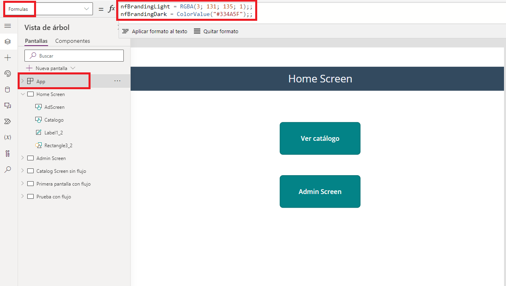

# Asignar variables globales
Como en todas las aplicaciones, siempre nos interesará establecer unas **variables globales** para así conseguir una homogeneidad de los elementos. Podemos establecer variables de todo tipo con el valor que deseemos. Gracias a esto, no tenemos que recurrir a buscar de qué color había establecido un botón o qué valor tenía por defecto un campo de texto, etc. 

Gracias a PowerApps, en la aplicación de **lienzo**, podemos establecer unas variables globales que podrán usarse en cualquier elemento (siempre que se proporcione una lógica de uso). 

Para establecer dichas variables, simplemente debemos seleccionar nuestra **App**, ir a las fórmulas y seleccionar **Fórmulas** y dentro de nuestro código podemos establecer el nombre de la variable y la igualamos a su valor. Como podemos apreciar en la imagen de arriba, se establecen dos variables ("nfBrandingLight" y "nfBrandingDark") y a ambas se les asigna colores distintos. 

Después, en cualquier parte de la aplicación, cuando vayamos a establecer un color, si llamamos al nombre de alguna de estas dos variables, se le asignará al elemento seleccionado el mismo color que se estableció en la variable global. 