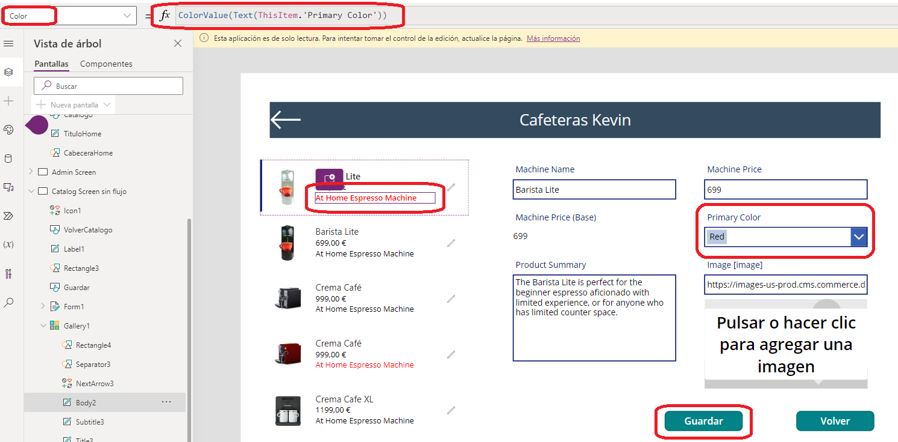

# Color
En una aplicación de **lienzo** podemos aplicar estilo a prácticamente todos los elementos que incorporemos en nuestro lienzo. Uno de los estilos a aplicar es el **color**. Para ello debemos seleccionar el elemento que queramos colorear e introducir el color que queramos. Hay varias maneras de introducir un color, una de ellas es a través de formato **RGBA**, formato **hexadecimal** utilizando la función `ColorValue("#FFFFFF")` y otra es seleccionando los colores establecidos que vienen en la plataforma. También hay opción de seleccionar el color a través de un **panel de color**, el cual podemos elegir tanto el mismo color como la transparencia del mismo.

Pero no sólo se puede cambiar de color indicándolo a mano, sino que se puede **"automatizar"** de cierta manera. Imagina tener una **Dataverse** donde una columna se llama **Color** y en dicha columna van apareciendo los colores que tiene cada producto. Pues gracias a esa información podemos establecer el color de cualquier elemento dependiendo del color que hayamos extraído de la **Dataverse**.

Mira el siguiente ejemplo:




Tenemos en la galería una lista de productos, si nos fijamos la pequeña descripción que tiene cada producto son de diferentes colores. Al lado tenemos un formulario donde se ve un **desplegable**. En ese desplegable salen los distintos colores que se muestran en la **Dataverse**. Pues nuestro usuario, puede seleccionar el artículo, seleccionar el color y establecerlo dándole a guardar. Al guardar, automáticamente se cambiará el color de esa descripción y, además, en la **Dataverse** también cambiará al color que le acaba de asignar nuestro usuario. 

El comando a utilizar es el siguiente: 
```Fpx
ColorValue(Text(ThisItem.'Primary Color'))
```

Para entenderlo un poco más, seleccionamos el texto que queremos que cambie de color, seleccionamos la fórmula color y la establecemos con el comando **ColorValue** y como parámetro metemos un "parse" de texto (**Text**) y a este le introducimos el valor que tiene la columna de **"Primary color"** llamándola a través de **ThisItem**, puesto que seleccionamos un producto en concreto. 