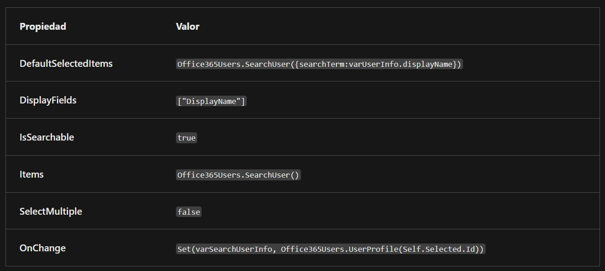

# ComboBox y Collect

## ComboBox
**ComboBox** es como un **menú desplegable** en una aplicación. Imagina que estás en una tienda de helados y te dan un **menú** con diferentes sabores. El **ComboBox** sería como ese **menú**: te muestra todas las opciones que tienes para elegir. Cuando haces clic en el ComboBox, aparece una lista con las opciones, y tú puedes seleccionar la que quieras. Por ejemplo, en una aplicación de contactos, podrías tener un ComboBox que te permite elegir entre diferentes grupos de contactos, como amigos, familiares, etc. 

Hay distintas propiedades a las que podemos acceder. En la siguiente imagen tienes las diferentes propiedades y el valor que devuelven:



La propiedad **DefaultSelectedItems** en un ComboBox de **Power Apps** te permite especificar qué elementos deben estar seleccionados por defecto cuando el ComboBox se carga inicialmente. Esto es útil cuando quieres preseleccionar elementos basados en ciertos criterios. Veamos qué hace esta función:

- **Office365Users**: es una conexión que permite interactuar con usuarios de Office 365 dentro de tu aplicación de **Power Apps**.
- **.SearchUser()**: es un método que busca usuarios dentro de Office 365.
- **{searchTerm: varUserInfo.displayName}**: aquí estás pasando un objeto como argumento para la función **SearchUser**. Este objeto tiene una propiedad **searchTerm** que especifica el término de búsqueda. **varUserInfo.displayName** es probablemente una variable que contiene el nombre de usuario que deseas buscar.

La propiedad **DisplayFields** te permite elegir qué información mostrar de cada elemento en la lista desplegable. Al establecer `["DisplayName"]`, estás indicando que solo quieres mostrar el nombre (**DisplayName**) de cada usuario en la lista desplegable.

La propiedad **IsSearchable** determina si los usuarios pueden buscar elementos en la lista desplegable escribiendo en ella. Cuando estableces **IsSearchable** como `true`, permite a los usuarios escribir texto en el ComboBox para filtrar y encontrar elementos rápidamente en lugar de desplazarse manualmente por toda la lista. Esto es útil cuando la lista de elementos es larga o cuando los usuarios conocen el nombre o parte del nombre del elemento que están buscando.

La propiedad **Items** define qué elementos se mostrarán en la lista desplegable. Al usar **Office365Users.SearchUser()** como su valor, indicas que quieres que el ComboBox muestre una lista de usuarios obtenidos de la búsqueda de usuarios en tu entorno de Office 365.

La propiedad **SelectMultiple** determina si los usuarios pueden seleccionar más de un elemento de la lista desplegable a la vez. Cuando estableces **SelectMultiple** en `false`, significa que solo se permite seleccionar un elemento a la vez. Esto es útil cuando solo necesitas que los usuarios elijan una opción de la lista desplegable en lugar de múltiples opciones simultáneamente.

La propiedad **OnChange** en un control de **Power Apps** se utiliza para especificar qué acción o función debe ejecutarse cuando el valor seleccionado en el control cambia.

En tu caso, tienes la función:
```Fpx
Set(varSearchUserInfo; UsuariosdeOffice365.UserProfile(Self.Selected.Id))
```
como el valor de la propiedad **OnChange**. Esta función realiza lo siguiente: 

- **Set**: es una función de Power Apps que se utiliza para asignar un valor a una variable. 

- **varSearchUserInfo**: es el nombre de la variable a la que se asignará un valor. 

- **UsuariosdeOffice365.UserProfile(Self.Selected.Id)**: es una función que busca el perfil de usuario en Office 365 utilizando el ID del usuario seleccionado en el control. 

Entonces, cuando el usuario selecciona un nuevo elemento en el control (en este caso, un ComboBox), esta función se activa. Obtendrá el perfil del usuario correspondiente al elemento seleccionado y lo asignará a la variable **varSearchUserInfo**. Esto puede ser útil si deseas almacenar información adicional sobre el usuario seleccionado para su posterior uso en tu aplicación. 


Otro ejemplo de código sería: 

```Fpx
Set(varSearchUserInfo; UsuariosdeOffice365.Manager(ComboAdmin.Selected.Id))
```

Esta línea de código también utiliza la función **Set** para asignar a la variable  
`varSearchUserInfo` la información del gerente del usuario seleccionado en un **ComboBox** llamado `"ComboAdmin"`. Aquí, cuando un usuario elige un elemento en el **ComboBox** `"ComboAdmin"`, esta línea de código obtiene y almacena la información del gerente de ese usuario en la variable `varSearchUserInfo`.

## Collect
**Collect** es una función en PowerApps que se utiliza para crear y manipular colecciones de datos. Piensa en una colección como una caja donde puedes guardar información para usarla más tarde en tu aplicación. Por ejemplo, podrías tener una colección de productos en una tienda en línea. Puedes usar **Collect** para agregar nuevos productos a la colección, eliminar productos existentes, o incluso modificar los datos de los productos. 

Ejemplo de código: 

```Fpx
ClearCollect(colDirectReports; UsuariosdeOffice365.DirectReportsV2(Self.Selected.Id).value)
```
Esta línea de código utiliza la función **ClearCollect** para crear una colección llamada  
`colDirectReports` y llenarla con los informes directos de un usuario seleccionado en un **ComboBox**. Esto significa que, cuando un usuario selecciona un elemento en el **ComboBox**, esta línea de código recopila y almacena los informes directos asociados con ese elemento en la colección `"colDirectReports"`.

```Fpx
Collect(colAddCollection; AddColumns(colItemsCollection; "Revenue"; UnitPrice * UnitsSold))
```
Aquí, **Collect** se utiliza para crear una nueva colección llamada  
`colAddCollection`. Esta colección se llena con los datos de otra colección llamada  
`colItemsCollection`. Además, se agregan nuevas columnas a esta nueva colección, como la columna `"Revenue"`, que se calcula multiplicando las columnas `"UnitPrice"` y `"UnitsSold"` de la colección original.

```Fpx
Collect(colDropCollection; DropColumns(colItemsCollection; "UnitPrice"))
```
Esta línea de código crea una nueva colección llamada  
`colDropCollection` basada en la colección original `colItemsCollection`.  
Sin embargo, se eliminan ciertas columnas de esta nueva colección utilizando la función **DropColumns**.  
En este caso, se elimina la columna `"UnitPrice"`.

```Fpx
Collect(colShowCollection; ShowColumns(colItemsCollection; "Name"))
```
Aquí, otra nueva colección llamada  
`colShowCollection` se crea basada en la colección original `colItemsCollection`.  
Sin embargo, esta vez se muestran solo ciertas columnas de la colección original utilizando la función **ShowColumns**.  
En este caso, solo se muestra la columna `"Name"`.

```Fpx
Collect(colRenameCollection; RenameColumns(colItemsCollection; "Name"; "Product"))
```
Esta línea de código crea otra nueva colección llamada  
`colRenameCollection`, que está basada en la colección original `colItemsCollection`.  
Sin embargo, en esta nueva colección, se cambia el nombre de una de sus columnas utilizando la función **RenameColumns**.  
En este caso, se cambia el nombre de la columna `"Name"` a `"Product"`.

Estas líneas de código se utilizan en conjunto para interactuar con los datos seleccionados por el usuario en **ComboBoxes** y almacenarlos en variables o colecciones para su posterior uso en la aplicación.
