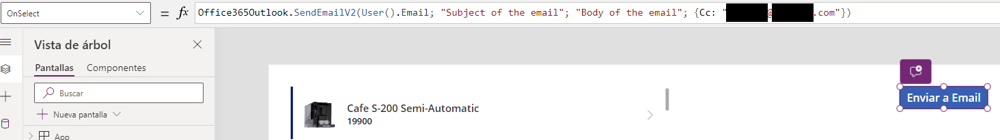

# Enviar un email

En **PowerApps** puedes configurar tu aplicación para enviar correos electrónicos usando un servicio de correo existente, como **Microsoft Outlook**, a través de conectores disponibles en **PowerApps**. Aquí te explico cómo puedes hacerlo: 

## Uso de conectores para enviar correos electrónicos 
**PowerApps** proporciona conectores integrados que permiten a las aplicaciones interactuar con servicios de correo electrónico como **Office 365 Outlook** y **Gmail**. Estos conectores te permiten enviar correos electrónicos directamente desde tu aplicación. Para usar estos conectores, debes:

### 1. Agregar el Conector a tu Aplicación:
- En el editor de **PowerApps**, ve a la pestaña **"Datos"** y busca el conector que necesitas (por ejemplo, **"Office365 Outlook"**).
- Agrega el conector a tu aplicación.

### 2. Configurar Permisos:
- Dependiendo del conector, es posible que necesites configurar permisos en **Azure AD** o en el servicio de correo para permitir que tu aplicación envíe correos electrónicos en nombre del usuario.

### 3. Usar el Conector en tu Aplicación:
- Puedes utilizar fórmulas para enviar correos electrónicos utilizando el conector. Por ejemplo, con el conector de **Outlook**, puedes usar una fórmula como esta:

```Fpx
Office365Outlook.SendEmailV2(
  "destinatario@example.com";
  "Asunto del correo electrónico";
  "Cuerpo del correo";
  {Cc: "cc@example.com", Bcc: "bcc@example.com"}
)
```
- Aquí, puedes especificar los destinatarios, el asunto, el cuerpo del mensaje: 



## Consideraciones Importantes

- **Permisos y Privacidad**: Asegúrate de que las políticas de tu organización permiten el uso de correos electrónicos de esta manera y que todos los permisos y configuraciones de privacidad están correctamente establecidos.

- **Cuentas de Usuario**: El usuario que utiliza la aplicación necesita tener una cuenta de correo válida con el servicio correspondiente al conector usado (por ejemplo, una cuenta de **Office 365** para el conector de **Outlook**).

- **Limitaciones de Uso**: Hay limitaciones sobre cuántos correos electrónicos puedes enviar y cómo se pueden enviar. Asegúrate de revisar las limitaciones del conector específico para evitar problemas.

---

## Alternativas

Si necesitas funcionalidades más avanzadas o específicas que no son soportadas por los conectores estándar, puedes considerar otras soluciones como:

- **Crear una función personalizada en Azure Functions o Power Automate**: Esto te permitiría manejar el envío de correos electrónicos con lógicas más complejas o integrar con sistemas que no tienen un conector disponible directamente en **PowerApps**.

- **Uso de APIs de terceros**: Algunas aplicaciones de correo electrónico ofrecen **APIs** que puedes integrar manualmente en tu aplicación a través de peticiones **HTTP**.
