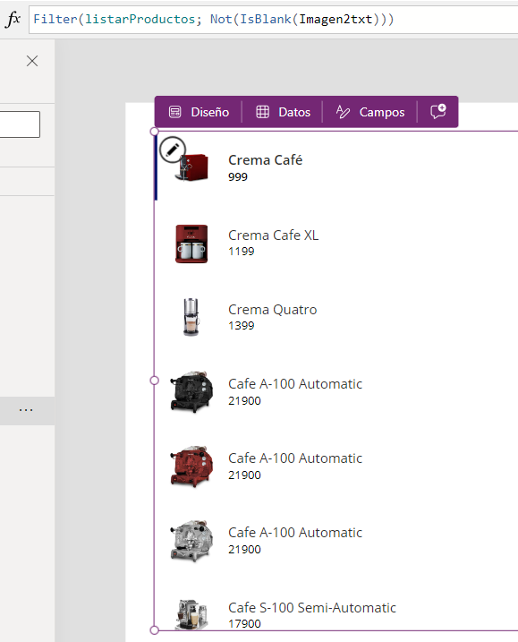

# Filtrar campos con imagen 
En una aplicación de **lienzo**, cuando damos nuestros primeros pasos, una de las primeras cosas que se aprenden es a cargar una **galería** que vaya conectada a una  
**Dataverse/Excel/Sharepoint**. En la galería se puede seleccionar qué campos de nuestra **Dataverse** mostrar. Uno de ellos es el de la **imagen** y, si en tu **Dataverse** hay una columna/campo donde se muestren **rutas de imágenes**, en nuestra galería se mostrará la imagen ya que la galería está diseñada para que acceda a través de la ruta a la imagen y nos la muestre.

Hay determinados casos en los que nuestra **Dataverse** tendrá filas donde no haya ruta de imagen, es decir, la persona que introdujo datos sobre un **producto/artículo**, no introdujo en su momento una ruta que accediera a la imagen del mismo producto/artículo. Este pequeño **"problema"** muchas veces se desencadena en que en nuestra galería pueden mostrarse productos sin imagen, lo cual genera **malas impresiones**, debido a que hay una **falta de información**. 

Para solucionar esto, una de las recomendaciones que podemos sugerir es la de **filtrar** esas filas por aquellas que **sí** tengan imagen. Con esto conseguimos que sólo se muestren las filas que dispongan de toda la información que nos interese. Para ello utilizamos el siguiente comando:

```Pfx
Filter(nombreDataverse; Not(IsBlank(columnaImagen)))
```

