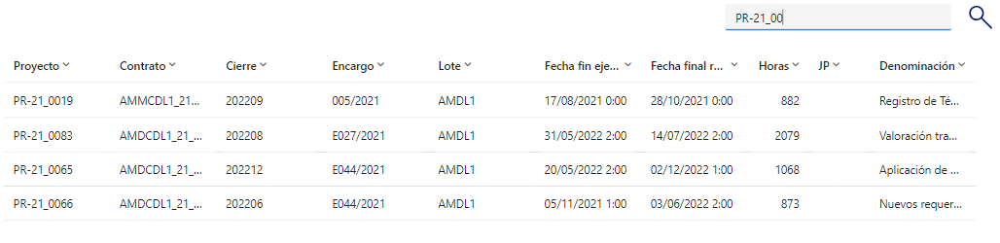

# Filtrar por columnas
En **PowerApps** podemos filtrar un conjuntos de datos de la siguiente manera: 
```Fpx
Filter(
    'Cierre proyecto';
    Or(
        TextInputCanvas2.Value in Proyecto;
        TextInputCanvas2.Value in Encargo;
        TextInputCanvas2.Value in Lote;
        TextInputCanvas2.Value in Cierre
    )
)
```
## Explicación breve del código

- **Filter()**:  
  Se utiliza para aplicar un filtro sobre una fuente de datos, que en este caso parece ser **'Cierre proyecto'**.  
  Esta fuente de datos podría ser una tabla, una colección, o incluso un conector a una base de datos externa.  
  El resultado será un subconjunto de **'Cierre proyecto'** donde se cumplen las condiciones especificadas.

- Dentro de la función **Filter()**, se utiliza la función **Or()** para combinar múltiples condiciones.  
  La función **Or()** devuelve `true` si al menos una de sus condiciones internas es verdadera.  
  En este contexto, se está evaluando si el valor ingresado en `"TextInputCanvas2.Value"`  
  coincide con algún valor en las columnas **Proyecto, Encargo, Lote,** o **Cierre** de la fuente de datos.

- **"TextInputCanvas2.Value in Proyecto;"** y las condiciones similares para **Encargo, Lote,** y **Cierre**:

  - **"TextInputCanvas2.Value"** se refiere al valor ingresado por un usuario  
    en un control de entrada de texto, presumiblemente denominado `"TextInputCanvas2"`.

  - Las partes **"in Proyecto"**, **"in Encargo"**, **"in Lote"**, y **"in Cierre"**  
    son condiciones que comprueban si el valor ingresado está presente en las listas o campos  
    (dependiendo de la plataforma, estos podrían ser columnas en una tabla o etiquetas en una colección)  
    llamados **Proyecto, Encargo, Lote,** y **Cierre**, respectivamente.

  - La expresión completa dentro de **Or** devuelve `true` si el valor de entrada  
    se encuentra en cualquiera de estas listas/campos.



En este ejemplo se filtra por las 4 primeras columnas. 