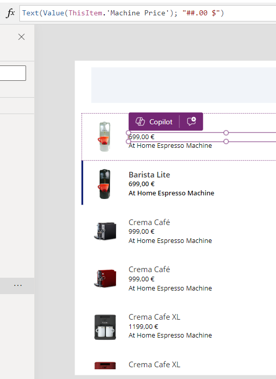
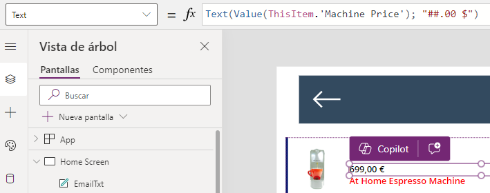

# Formato precio

En una aplicación de lienzo podemos establecerle un formato determinado a una columna numérica de nuestra tabla de **Dataverse**. En **PowerApps**, el formato de la fecha y los números puede depender de la configuración regional establecida en el entorno en el que estás trabajando. La configuración regional no solo afecta al formato de fecha y hora, sino también a la forma en la que se visualizan los números, las monedas, y otros tipos de datos.

Por ejemplo, en el siguiente ejemplo vamos a darle formato a la columna **"Price"** con el número definido, una coma, 2 decimales y el símbolo (**"$"** o **"€"**, dependiendo de la región):


```Fpx
Text(Value(ThisItem.'Machine Price'); "##.00 $")
```
Para hacer una prueba vamos a hacerlo con la columna **"Machine Price"** y podemos observar el resultado (salen **"€"** porque es región **"España"**): 



La fórmula de **Power FX** se debe poner en la propiedad **"Text"**:



## Configuración Regional en Power Apps 

La configuración regional de la aplicación generalmente se establece en el nivel del entorno de **PowerApps** y puede afectar todos los componentes de la aplicación.

Si te encuentras con problemas donde la fecha u otros formatos no están apareciendo como esperas, deberías verificar:

- La configuración regional de tu entorno de **PowerApps**.
- La configuración regional del navegador o dispositivo si estás utilizando **PowerApps** en un navegador o en dispositivos móviles.
- La configuración regional del usuario en **Microsoft 365**, ya que esto también puede influir.

Para cambiar la configuración regional de tu entorno de **PowerApps**, normalmente necesitarías tener permisos de administrador para ajustar esta configuración en el Centro de administración de **Power Platform**.
