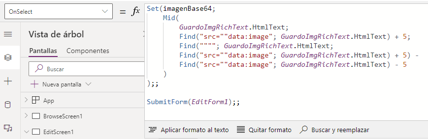
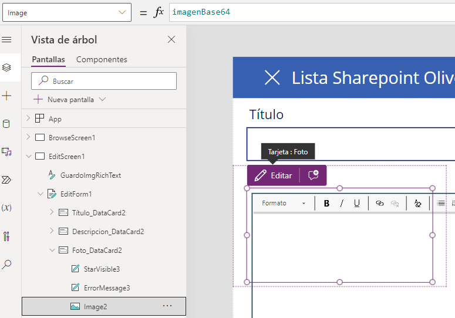
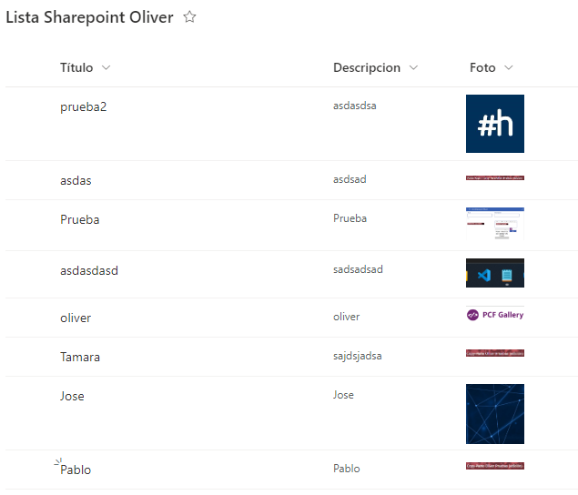

# Guardar Imagen de Rich Text en Sharepoint 

Para guardar una imagen en un **Sharepoint** primero lo que tenemos que hacer es dirigirnos a Sharepoint y dentro de un sitio (o creamos uno) vamos a crear una **lista**: 


Le damos a **"Nuevo elemento"** y creamos una lista (podemos crearla en blanco, desde una existente, de un Excel, CSV...): 


Yo he creado esta lista donde se almacenarán las imágenes. Creamos una columna, le asignamos el tipo **"Imagen"** y le ponemos le nombre que queramos: 


Luego le damos a la parte superior donde pone **"Integrar"**, luego a **"Power Apps"** y a **"Crear una aplicación"**. 


Nos crea una aplicación con un **CRUD** completo para ir probando e ir tratando el **Sharepoint**. Lo adaptamos a nuestro gusto y lo podemos probar y comprobar que funciona correctamente. 

Ahora en la pantalla de crear un nuevo registro vamos a meter un componente **"Rich Text"**. 


En el botón o icono de confirmar/guardar que utilizaremos para crear un registro en el **Sharepoint** le vamos a establecer este código en la propiedad **"OnSelect"**: 

```Fpx
Set(imagenBase64;
    Mid(
        GuardoImgRichText.HtmlText;
        Find("src=""data:image"; GuardoImgRichText.HtmlText) + 5;
        Find(""""; GuardoImgRichText.HtmlText;
        Find("src=""data:image"; GuardoImgRichText.HtmlText) + 5) -
        Find("src=""data:image"; GuardoImgRichText.HtmlText) - 5
    )
);;

SubmitForm(EditForm1);;
```


Este código básicamente lo que hace es crear una variable llamada **imagenBase64** que contendrá la **URL** de la imagen dividida. Con **Mid** lo que hacemos es hacer como un substring dividiéndo la cadena en trozos, que con **Find** los encontramos. Y ya luego con el **SubmitForm** enviamos el formulario. 

Básicamente la URL que separamos es la siguiente (la de la imagen), al pegar un screenshot de una imagen en el texto enriquecido:  


Sería: **data:image/png;base64,iVBORw0KGgoAAAANSUhEUgAAATQAAAAlCAYAAA...**

En la propiedad **"OnVisible**" de la pantalla le establecemos lo siguiente para que por defecto al entrar a esta pantalla el texto enriquecido esté vacío: 

```Fpx
UpdateContext({varTextoEnriquecido: ""})
```


En el texto enriquecido le establecemos  en la propiedad **"Default"** la variable creada en la pantalla: **varTextoEnriquecido**. 

Al campo del formulario referente a la **Imagen** le establecemos el contenido del **Set** creado anteriormente en la propiedad **"Image"** y ocultamos el campo (establecer el visible a desactivado). 



Ahora vamos a probar la aplicación. 


 

Comprobamos que se han guardado los registros correctamente en la **lista** de **Sharepoint**. 

 


## ¡¡¡ IMPORTANTE !!! 
Si insertamos texto en el **Rich Text** se va a ignorar y no aparecerá ni se almacenará en ningún sitio. También es importante saber que si ponermos más de un screenshot no se guardarán, sólo se guarda el primero porque esta imagen se guardará en un columna del **Sharepoint**, por lo que sólo se podría guardar una. 

Además es importante saber que las imágenes se guardarán con un **ID único**: 
 


Todas estas imágenes se van a guardar en una **Biblioteca de Archivos** local por defecto, que estará ubicado dentro del sitio en **Contenido del Sitio > Activos del Sitio > Lists**. 

 
Aquí podremos encontrar una carpeta con un nombre muy extraño donde se almacenarán todas las imágenes que se suben al crear un registro en el **Sharepoint**. 

