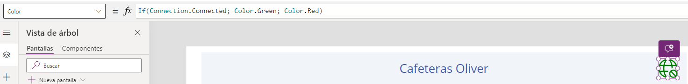

# Mostrar un icono de si el usuario tiene conexión a internet o no en Dispositivos Móviles 
En **PowerApps**, podemos indicar mediante un icono si el usuario tiene conexión a internet o no, lo vamos a indicar añadiendo un icono y en la propiedad **"Color"** le ponemos lo siguiente: 

```Fpx
If(Connection.Connected; Color.Green; Color.Red)
```
Utilizamos **"Connection"** y dependiendo de si hay conexión o no aparecerá el icono de un color u otro. 

En este caso aparece en color verde porque hay conexión, si no hubiese conexión aparecería en color rojo. 