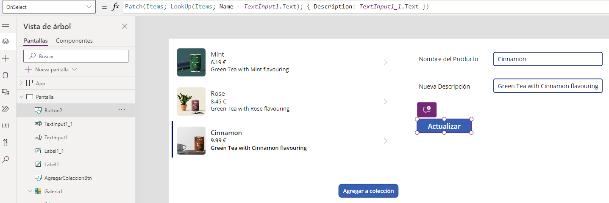

# Patch
En **PowerApps**, la función **Patch()** es utilizada para **modificar o crear registros en una fuente de datos**, como puede ser una lista de **SharePoint**, una tabla de **SQL Server**, o una entidad en **Common Data Service**.  
Esta función es particularmente útil porque permite **actualizar parcialmente un registro existente o insertar un nuevo registro sin la necesidad de manejar el registro completo**.

Por ejemplo, podemos cambiar la descripción de un producto, en el botón de actualizar, en la fórmula `"OnSelect"`, se debe introducir lo siguiente para que cambie la descripción:

```Fpx
Patch(Items; LookUp(Items, Name = TextInput1.Text); {Description: TextInput1_1.Text})
```

Ejemplo de uso: 


- **Patch()**: Es la función utilizada para modificar un registro en una fuente de datos.  
  Puede ser usada para actualizar un registro existente o para crear uno nuevo.  
  En este caso, se está utilizando para actualizar.

- **Items**: Es la colección o la tabla donde se encuentra el registro que se va a modificar.  
  Podría ser una colección local en **PowerApps**, una lista de **SharePoint**, una tabla de **SQL Server**, etc.

- **LookUp(Items, Name = TextInput1.Text)**:  
  Esta función **LookUp()** se usa para encontrar el primer registro dentro de la colección `"Items"`  
  que cumpla con la condición especificada `(Name = TextInput1.Text)`.  
  Es decir, busca en la colección `"Items"` un registro donde el campo `"Name"`  
  coincida con el texto ingresado por el usuario en el control `"TextInput1"`.  
  Al poner `"TextInput1.Text"` nos referimos al valor ingresado por el usuario en el control **TextInput1**,  
  que se usa para identificar el registro a actualizar.

- **{Description: TextInput1_1.Text}**:  
  Este es un registro con la especificación de los cambios que se desean aplicar al registro encontrado.  
  En este caso, se está actualizando el campo `"Description"` del registro encontrado con el valor del control `"TextInput1_1"`.  
  Con `"TextInput1_1.Text"` hacemos referencia al valor ingresado por el usuario en otro control de texto `"TextInput1_1"`,  
  que se usa para actualizar el campo `"Description"`.

## Funcionamiento del código
- Cuando este código se ejecuta (por ejemplo, al hacer clic en un botón), **PowerApps** busca  
  en `"Items"` un registro donde el campo `"Name"` es igual al valor actual en `"TextInput1"`.

- Si encuentra un registro que coincide, la función **Patch()** actualiza el campo `"Description"`  
  de ese registro con el valor que el usuario ha ingresado en `"TextInput1_1"`.

- Si no se encuentra ningún registro que cumpla con la condición, no se realizará ninguna actualización.

## Sintaxis básica 
1. **Para actualizar un registro existente:**
```Fpx
Patch(DataSource, DefaultRecord, Changes)
```
2. **Para crear un nuevo registro:**
```Fpx
Patch(DataSource, Defaults(DataSource), Changes)
```
- **DataSource**: La fuente de datos donde se encuentra el registro que se desea modificar.

- **DefaultRecord**: El registro que se desea modificar. Este es usualmente obtenido directamente de la fuente de datos.

- **Changes**: Un registro con los campos que se desean cambiar y los nuevos valores para esos campos.

Es importante tener en cuenta también la función **GUID()**, la cual genera un nuevo identificador único global (**GUID**), que es útil cuando necesitas crear un registro único y garantizar que su identificador sea distinto de cualquier otro existente. Este tipo de identificador es comúnmente usado en bases de datos y sistemas donde la unicidad entre registros es crítica. 

Supongamos que quieres usar **GUID()** para asignar un **ID único** a un nuevo registro que estás creando en una fuente de datos a través de la función **Patch()**. Aquí te muestro cómo podrías hacerlo: 

```Fpx
Patch(
    Entrenamiento;
    First(Filter(Entrenamiento;GUID(DataCardValue4.Value));
    {
      Subject: DataCardValue10_3.Value;
      'calenadar purpose': DataCardValue14_3.Value;
      'content/menssage': DataCardValue15_3.Value;
      manager: DataCardValue7_3.Value;
      'meeting date': MeetingDateSelect1_4.SelectedDate;
      length: MeetingDateSelect1_4.Selected.Minutes                                    
    }
    )
)
```
## Consideraciones Importantes

- **Unicidad del GUID**: Aunque los **GUIDs** son **"globalmente únicos"**, es muy raro (pero teóricamente posible) que dos llamadas a **GUID()** generen el mismo valor.  
  En la práctica, puedes considerarlos únicos.

- **Rendimiento y Costos**: Si estás trabajando con una base de datos externa, como **SQL Server** o **Cosmos DB**,  
  ten en cuenta que cada llamada a **Patch()** puede incurrir en costos de transacción o afectar el rendimiento,  
  especialmente si se hacen en volumen.

- **Validación de Entradas**: Asegúrate de validar las entradas del usuario  
  (`TextInput_Nombre.Text` y `TextInput_Email.Text`) antes de crear el registro para prevenir  
  la inserción de datos incorrectos o maliciosos.


Otros ejemplos con **ForAll** y **Patch**: 
Cómo se puede utilizar **Patch** para crear un nuevo registro en una tabla (denominada **"Tabla1"**) usando los datos recogidos de un formulario.  

```Fpx
ForAll(Formulario;
    Patch(Tabla1;Defaults(Tabla1);
    {
        Encargo:Encargo_DataCard1;
        Contrato:Contrato_DataCard1;
        Proyecto:Proyecto_DataCard1;
        Denominación:Denominación_DataCard1;
        Horas:Horas_DataCard1;
        'Importe sin iva':'Importe sin iva_DataCard1';
        'Importe con iva':'Importe con iva_DataCard1';
        'Fecha fin ejecución comprometida':'Fecha fin ejecución comprometida_DataCard7';
        'Fecha Final Real Ejecución':'Fecha Final Real Ejecución_DataCard3';
        'Descripción de cierre':'Descripción de cierre_DataCard7';
        JP:JP_DataCard3;
        Cierre:Cierre_DataCard3;
        Lote:Lote_DataCard3;
        Observaciones:Observaciones_DataCard4
    }
    )
)
```
A continuación, explicaremos cada parte del código paso a paso:

### **ForAll**:  
Notamos que el código está encapsulado dentro de una función **ForAll**.  
Se utiliza para ejecutar una fórmula sobre cada elemento de una tabla o colección.

### **Patch**:  
Se usa para modificar o crear un registro en una fuente de datos.  
En tu ejemplo, se está utilizando para agregar un nuevo registro a la tabla **"Tabla1"**  
utilizando la siguiente sintaxis:

- **"Tabla1"**: Es la fuente de datos destino.

- **"Defaults(Tabla1)"**: Esto genera un registro con todos los valores predeterminados para los campos de la tabla.  
  Es utilizado aquí para crear un nuevo registro.

- **{...}**: Es un bloque de código donde especificas los campos del registro y los valores que deseas asignar a cada uno de ellos.  
  Dentro se definen los campos de **"Tabla1"** y los valores que se asignarán.  
  Cada campo de la tabla está vinculado a un componente específico del formulario, usualmente una tarjeta de datos (**DataCard**).  
  Por ejemplo:

  - **"Encargo: Encargo_DataCard1"** significa que el valor del campo `"Encargo"` en la tabla será tomado del valor actual de `"Encargo_DataCard1"` en el formulario.

  - Los campos con espacios, como `"Importe sin iva"`, deben ser escritos entre comillas.


## Consideraciones Adicionales 

- Asegúrate de que todos los nombres de campos y tarjetas de datos estén correctamente escritos y existan en el contexto de la aplicación. 

- Verifica que los tipos de datos de las tarjetas de datos correspondan a los tipos de datos de los campos en la tabla para evitar errores de tipo. 