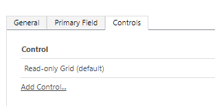

# Configurar una columna de estados por colores 

## Crear un columna de elección 
Primero hay que crear y configurar una columna de elección que determinará los diferentes estados para nuestra vista. Hay que seleccionar a la izquierda de cada valor, dentro de la configuración de la columna, el color deseado. 

## Cambiando la vista 
Selecciona el icono de configuración en la barra de menú en make.powerapps.com y luego selecciona Configuración avanzada. 

Ahora, en el menú desplegable de configuración, arriba a la izquierda, selecciona "Soluciones" y selecciona la solución en la que estás trabajando. Selecciona "Entidades" y busca la tabla donde has creado la columna. 

Ahora selecciona la pestaña de "Controles". Luego selecciona "Agregar control". 

Luego agrega el "Control de cuadrícula de Power Apps" (Power Apps grid control). 

Ahora debes establecer la propiedad 'Habilitar colores de OptionSet' en Sí para que se muestren los colores de las opciones. 

Una vez que haya realizado los cambios, presiona el botón Guardar y publicar y listo ✔️ 

