> Para filtrar por los campos que sí tienen imagen

```pfx
Filter(listarProductos; Not(IsBlank(Imagen2txt)))
```

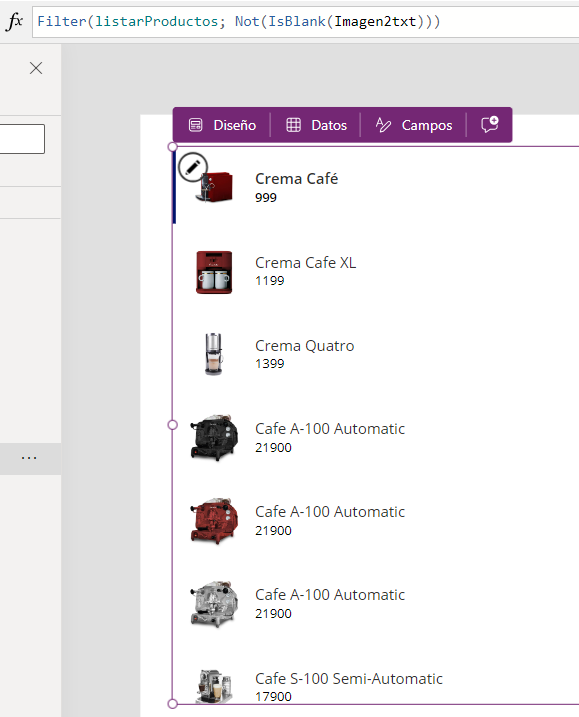

> Para introducir el formato de precio

```pfx
Text(Value(ThisItem.'Machine Price'); "##.00 $")
```

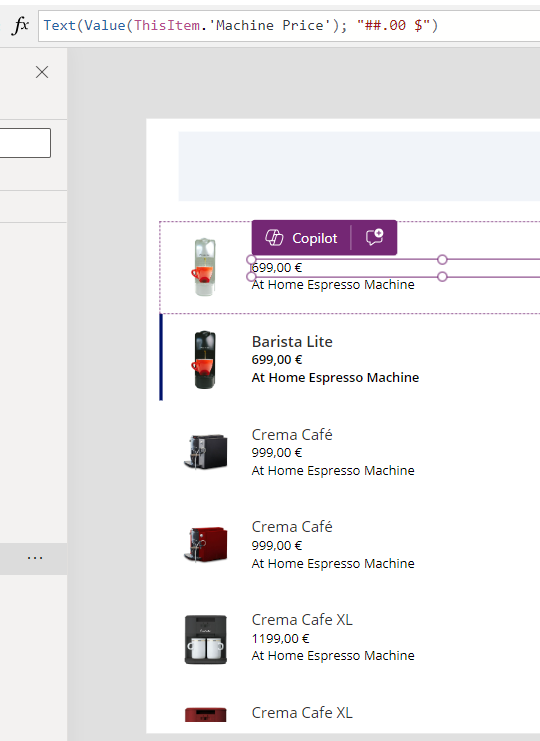

> Para asignar el color procedente del campo del formulario

```pfx
ColorValue(Text(ThisItem.'Primary Color'))
```

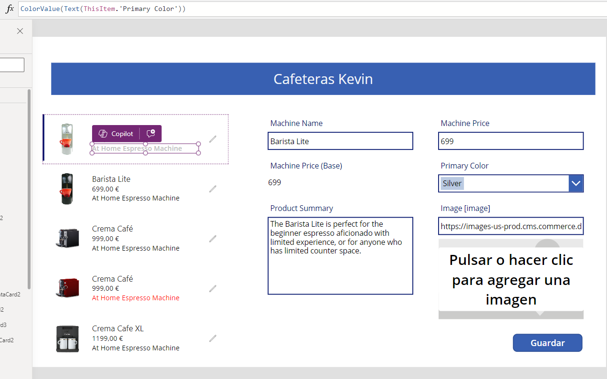

> Para asignarle al label el nombre de la pantalla (propiedad 'Text')

```pfx
'Home Screen'.Name
```

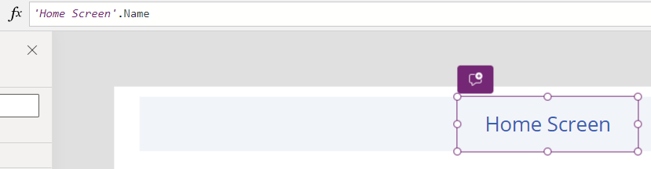

> Para asignar variables globales que se pueden utilizar en cualquier parte de la app

```pfx
nfBrandingLight = RGBA(3; 131; 135; 1);;
nfBrandingDark = ColorValue("#334A5F");;
```


> Para resetear o reiniciar el texto de un input

```pfx
Reset(TextInput1)
```

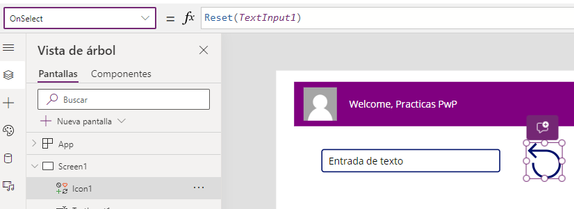

> Para configurar el email

```pfx
Office365Outlook.SendEmailV2(User().Email; "Asunto del correo electrónico"; "Cuerpo del correo";{Cc: "kmartinezm@hiberus.com"})
```

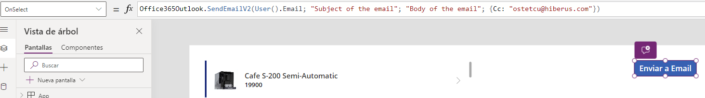

> ComboBox: Sacar información del usuario seleccionado

```pfx
Set(varSearchUserInfo; UsuariosdeOffice365.UserProfile(Self.Selected.Id))
```

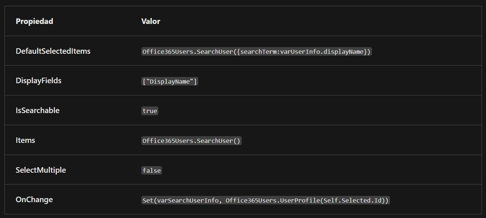

> ComboBox: Sacar información del administrador seleccionado (si no es admin no aparecen datos)

```pfx
Set(varSearchUserInfo; UsuariosdeOffice365.Manager(ComboAdmin.Selected.Id))
```

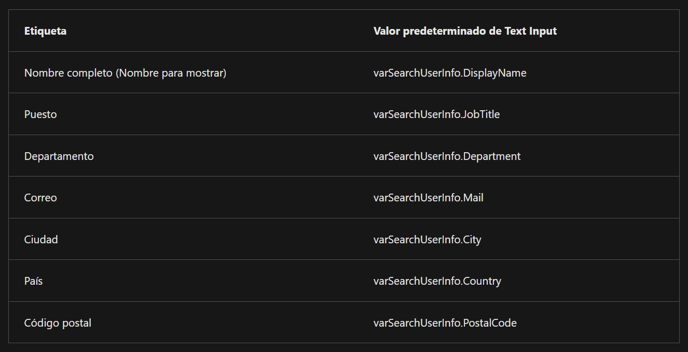

> ComboBox: Sacar los subordinados de un usuario seleccionado del ComboBox

```pfx
ClearCollect(colDirectReports; UsuariosdeOffice365.DirectReportsV2(Self.Selected.Id).value)
```

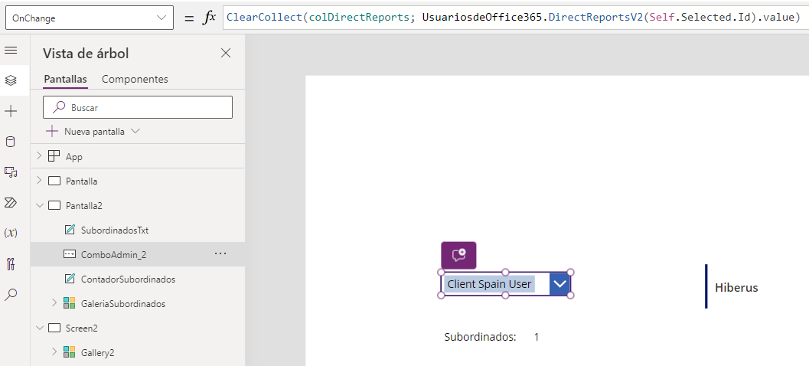

En la galería se pone: colDirectReports

> Collection

```pfx
Collect(colAddCollection; AddColumns(colItemsCollection; "Revenue"; UnitPrice * UnitsSold))
```


```pfx
Collect(colDropCollection; DropColumns(colItemsCollection; "UnitPrice"))
```


```pfx
Collect(colShowCollection; ShowColumns(colItemsCollection; "Name"))
```


```pfx
Collect(colRenameCollection; RenameColumns(colItemsCollection; "Name"; "Product"))
```

> Para cambiar la descripción de un producto, en el botón de actualizar, en la fórmula OnSelect, se debe introducir lo siguiente para que cambie la descripción

```pfx
Patch(Items,LookUp(Items, Name = TextInput1.Text), { Description: TextInput1_1.Text })
```

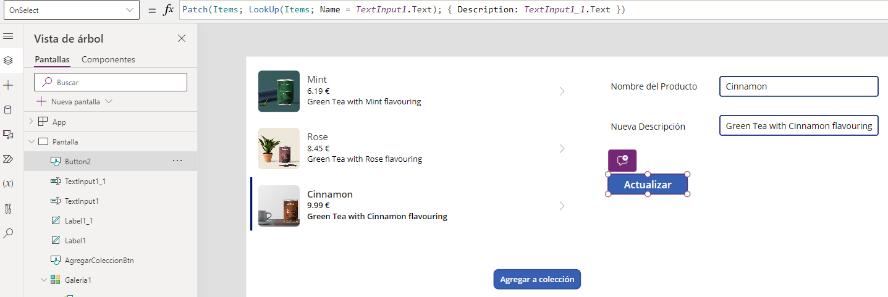


> Formularios

- ViewForm(YourFormName): establece el formulario en modo de vista.

- EditForm(YourFormName): establece el formulario en modo de edición.

- NewForm(YourFormName): establece el formulario en modo nuevo.


OnFailure: Notify("¡No se ha podido guardar! Por favor, intenta de nuevo más tarde o contacta a un administrador."; NotificationType.Error)

OnSuccess: Navigate(Pantalla; ScreenTransition.Cover);; Notify("You have successfully submitted a record for " & Self.LastSubmit.Name);;

LastSubmit: Formulario.LastSubmit.Nombre                (Último registro enviado correctamente del formulario)

OnReset: Si se establece el formulario.

Concatenar campos: ThisItem.FirstName & " " & ThisItem.LastName


> Procedimientos recomendados para las opciones avanzadas

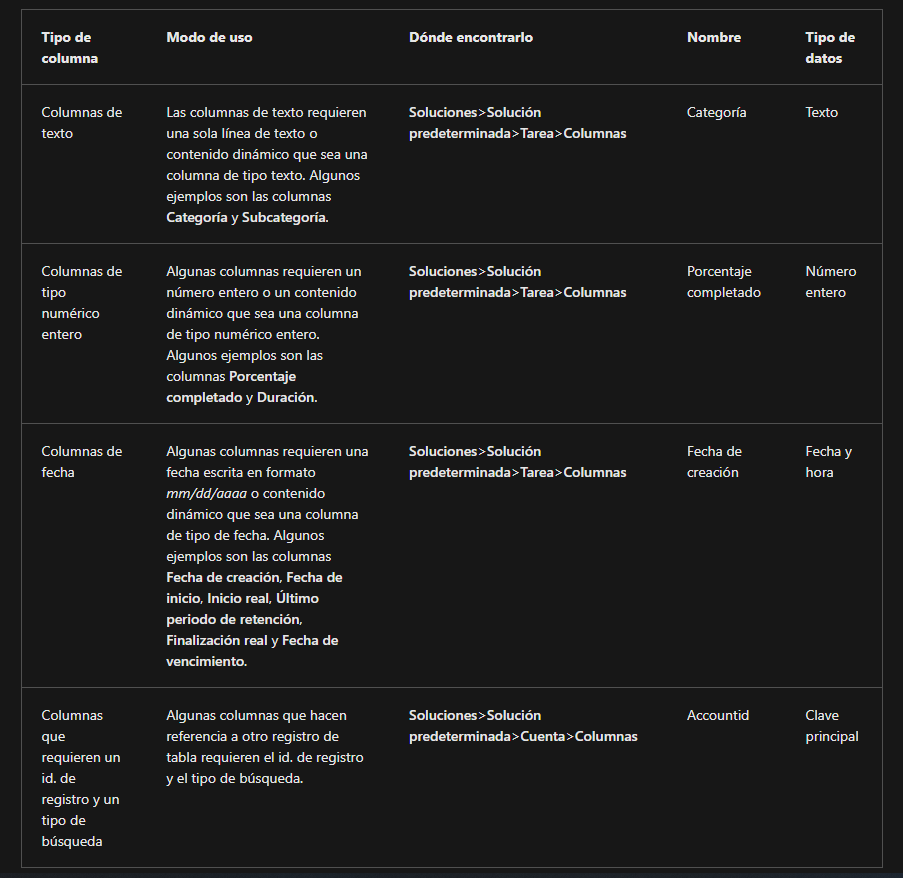

> PRocedimiento para hacer acciones con una base de datos SQL

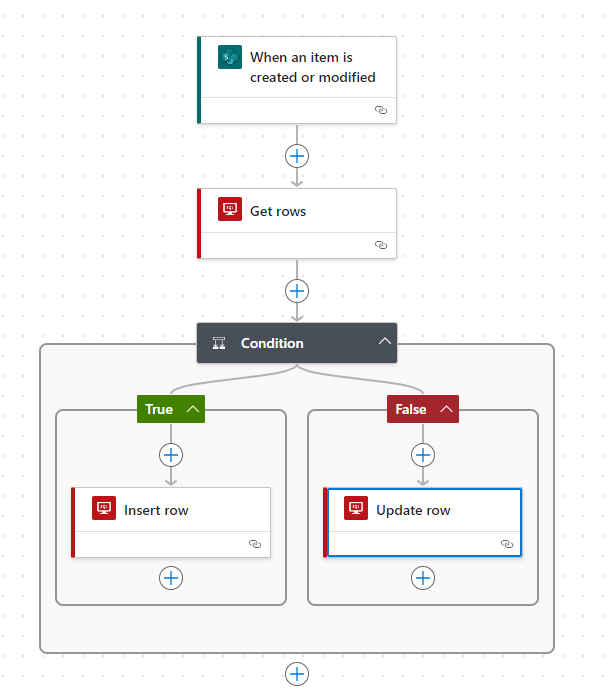


# Microsoft Power Platform
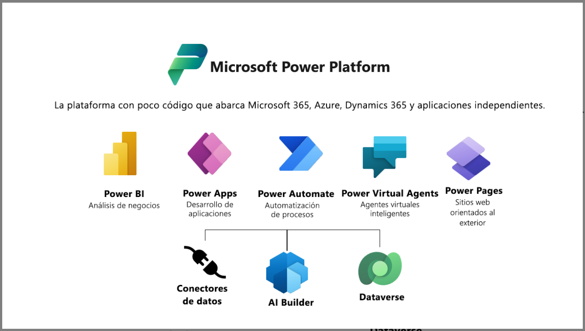

# Cómo determinar la aplicación que va a utilizar

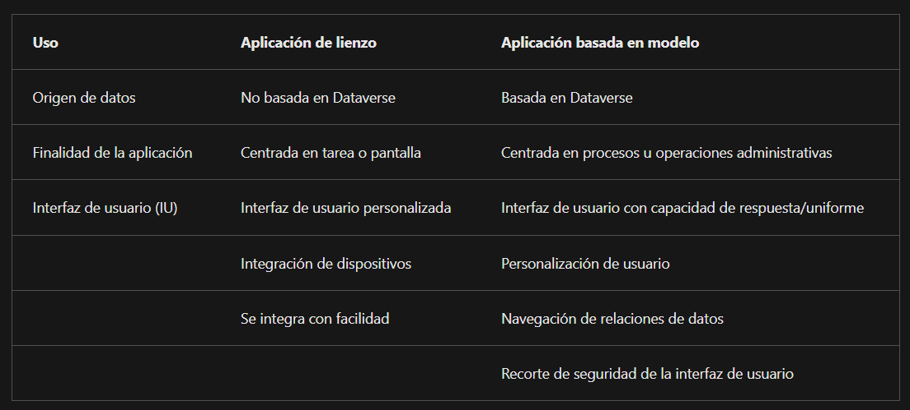


# Power Automate Filter Query Operators and Functions

* **eq** for equals
* **ne** for not equals
* **gt** for greater than
* **ge** for greater than or equal to
* **lt** for less than
* **le** for less than or equal to


```pfx
ForAll(Formulario;
Patch(Tabla1;Defaults(Tabla1);
{
    Encargo:Encargo_DataCard1;
    Contrato:Contrato_DataCard1;
    Proyecto:Proyecto_DataCard1;
    Denominación:Denominación_DataCard1;
    Horas:Horas_DataCard1;
    'Importe sin iva':'Importe sin iva_DataCard1';
    'Importe con iva':'Importe con iva_DataCard1';
    'Fecha fin ejecución comprometida':'Fecha fin ejecución comprometida_DataCard7';
    'Fecha Final Real Ejecución':'Fecha Final Real Ejecución_DataCard3';
    'Descripción de cierre':'Descripción de cierre_DataCard7';
    JP:JP_DataCard3;
    Cierre:Cierre_DataCard3;
    Lote:Lote_DataCard3;
    Observaciones:Observaciones_DataCard4
    
}
))
```

En Default meter "FormMode.New"

> Para dispositivos móviles mostrar un icono de si el usuario tiene conexión a internet o no, en verde o rojo
```pfx
If(Connection.Connected; Color.Green; Color.Red)
```

concat(
    formatDateTime(triggerOutputs()?['body/kevin_fechayhora'], 'dddd, dd "de" MMMM "de" yyyy', 'es'), ' ',
    formatDateTime(triggerOutputs()?['body/kevin_fechayhora'], 'HH:mm')
)

formatDateTime(triggerOutputs()?['body/kevin_horafin'], 'HH:mm')


> FILTER

```pfx
Filter(
    'Cierre proyecto';
    Or(
        TextInputCanvas2.Value in Proyecto;
        TextInputCanvas2.Value in Encargo;
        TextInputCanvas2.Value in Lote;
        TextInputCanvas2.Value in Cierre
    )
)
```

> Conectar desde una aplicación de lienzo un flujo y asociarlo a un botón

```pfx
MiFlujo.Run(Campos)

Ej:
NOVACTA.Run(Cierre.Selected.Value; Fecha.SelectedDate)
```


Power FX, IntelliSense, PowerApps, Power Automate, Power BI, Power Pages, Aplicaciones de Lienzo y Modelo de Datos, Web responsive, Flujos de Procesos de Negocio, 


> Pequeña guía para los flujos, filtros, etc.:

https://www.spguides.com/power-automate-odata-filter-query/


